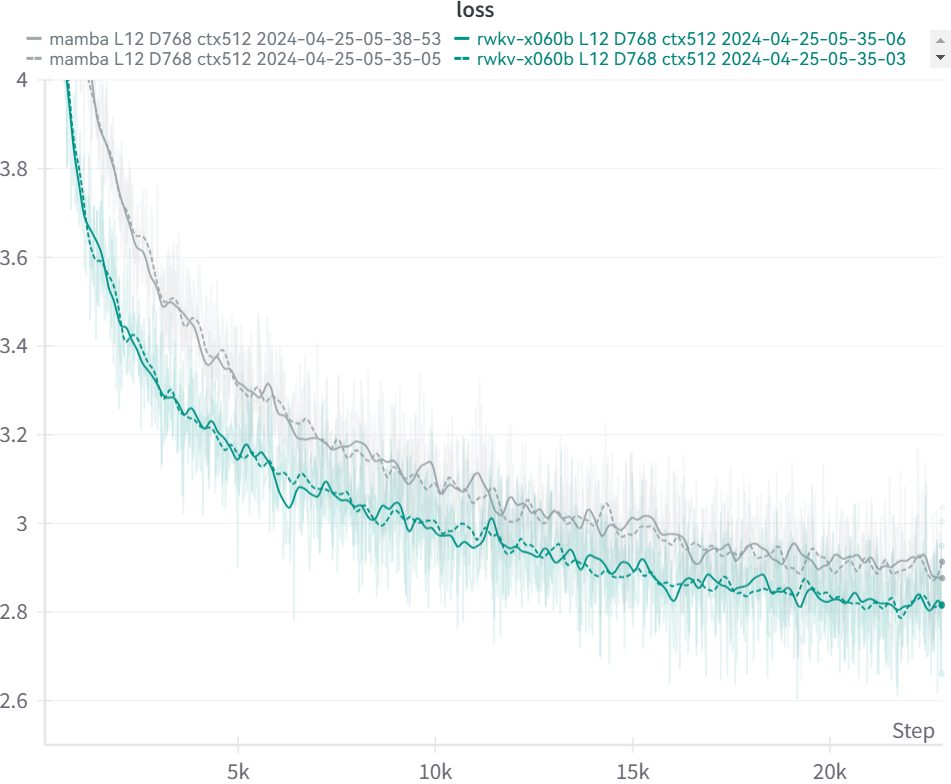

# LinearAttentionArena

Here we will test various linear attention designs.
```
pip install pytorch-lightning==1.9.5 torch deepspeed wandb ninja --upgrade
```
RWKV-6.0b differences (vs RWKV-6.0): GroupNorm => LayerNorm, and remove "gate" in TimeMix, so the params count is lower.
```
# Example: RWKV-6.0b L12-D768 (189M params) on 4x4090, minipile 1.5B tokens loss 2.812

./prepare.sh --model_type "x060b" --layer 12 --emb 768 --ctx_len 512 --suffix "-0"

./train.sh --model_type "x060b" --layer 12 --emb 768 --lr_init "6e-4" --lr_final "2e-4" --ctx_len 512 --n_gpu 4 --m_bsz 32 --grad_cp 0 --save_period 1000 --suffix "-0"
```
```
# Example: Mamba L12-D768 (191M params) on 4x4090, minipile 1.5B tokens loss 2.885

./prepare.sh --model_type "mamba" --layer 12 --emb 768 --ctx_len 512 --suffix "-0"

./train.sh --model_type "mamba" --layer 12 --emb 768 --lr_init "6e-4" --lr_final "2e-4" --ctx_len 512 --n_gpu 4 --m_bsz 32 --grad_cp 0 --save_period 1000 --suffix "-0"
```

